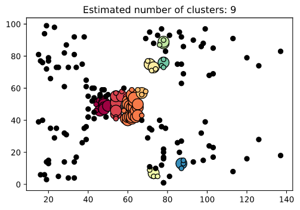

# DBSCAN Clustering
Getting started with Density-Based Clustering with DBSCAN

Goal: Cluster different user groups according to based on their annual income and spending patterns and detect outliers

Open the Jupyter notebook and enjoy it!